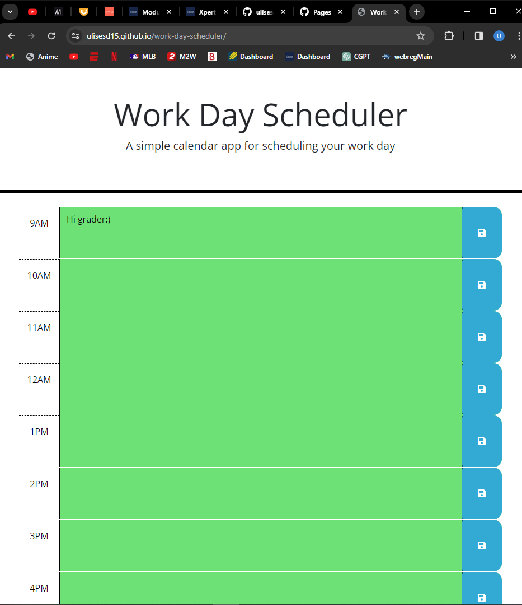

# Work day scheduler

## User Story
As a user, I want to be able to see the current day at the top of the website, I want to type in my todos and save them on the page until changed, and each block should change background color depending on the time of the day

## Acceptance Criteria
GIVEN I am using a daily planner to create a schedule
WHEN I open the planner
THEN the current day is displayed at the top of the calendar
WHEN I scroll down
THEN I am presented with time blocks for standard business hours of 9am to 5pm
WHEN I view the time blocks for that day
THEN each time block is color-coded to indicate whether it is in the past, present, or future
WHEN I click into a time block
THEN I can enter an event
WHEN I click the save button for that time block
THEN the text for that event is saved in local storage
WHEN I refresh the page
THEN the saved events persist

## Webpage URL
https://ulisesd15.github.io/work-day-scheduler/

## Webpage Screenshot

## How to Access Files
work-day-scheduler/assets/style.css
work-day-scheduler/assets/script.css
work-day-scheduler/index.html